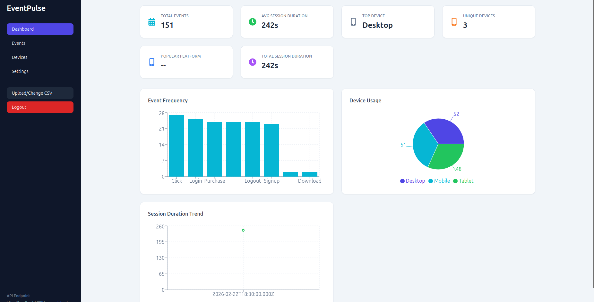

eventpulse-analytics-dashboard
├── frontend
├── backend
└── assets

# EventPulse – Product Analytics Dashboard



EventPulse is a modern, full-stack analytics dashboard built with the PERN stack (PostgreSQL, Express, React, Node.js).

This application lets you upload your own analytics CSV, tracks user engagement events, and visualizes product metrics with beautiful, interactive charts and KPI cards.

## Features

* Upload and analyze your own analytics CSV file
* Event frequency and device usage breakdown
* Session duration trends
* Top device and most popular platform stats
* Interactive charts and responsive dashboard
* REST API with authentication
* PostgreSQL for persistent event storage

## Tech Stack

Frontend
- React (Vite)
- Tailwind CSS
- Recharts
- React Router
- Axios

Backend
- Node.js
- Express
- PostgreSQL

## Project Structure

```
eventpulse-analytics-dashboard
├── frontend
├── backend
└── assets
```

git clone https://github.com/yourusername/eventpulse-analytics-dashboard.git

## Setup

Clone the repository:

```
git clone https://github.com/yourusername/eventpulse-analytics-dashboard.git
cd eventpulse-analytics-dashboard
```

Install and run the frontend:

```
cd frontend
npm install
npm run dev
```

Install and run the backend:

```
cd backend
npm install
node index.js
```

Create a `.env` file in the backend directory with your database configuration (see `.env.example` for reference).

## Author

Sitaram Dubagunta
